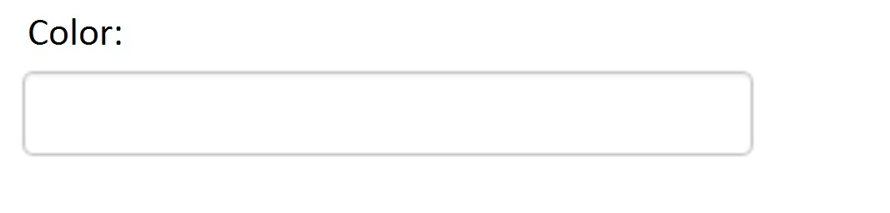
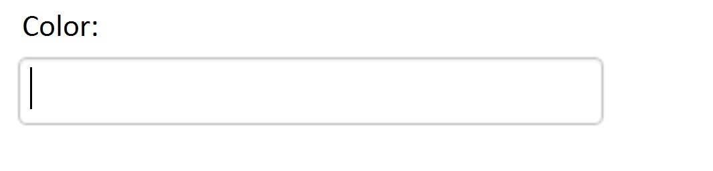
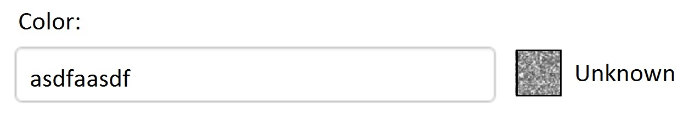
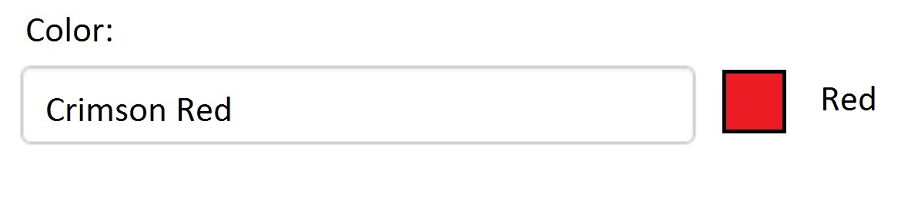

# Omnicolor Project

This project uses machine learning to determine the RGB values and simplified color name for a given color name

#### Project Introduction:

Our goal is to build a tool for the Lead Services Team that will take color names from our consumers and compute both an RGB value for that described color and provide a simplified color name. For example, “Decorous Amber” should return: {"rgb": [255, 191, 0], "simplified": "Orange"}

#### Business Case / Benefits Of Project:

This project will allow us to satisfy our customers better by making sure that their dream car is exactly the color they want it to be. 

#### Objectives & Scope:

To build our tool we will use a combination of machine learning, data mining, and frontend tools. There are hundreds of different names for colors. Our machine learning tools (likely to be a neural network) will be able to approximate just the right shade of a color based on the name. In order to create this neural network we will need to identify features of our data that we can use to determine the correct RGB value. This is where data mining skills will be used. Lastly, we will use frontend skills to display an image of the color our algorithm computes next to the “color name” text box in real-time, as well as the simplified color name for that color. See the pictures below for more details.

***

## Use Cases

#### No text, no cursor in textbox:

#### No text, cursor in textbox:

#### Text in textbox, doesn’t recognize color name:

#### Text in textbox, does recognize color name:

